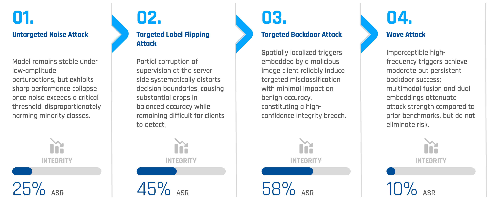
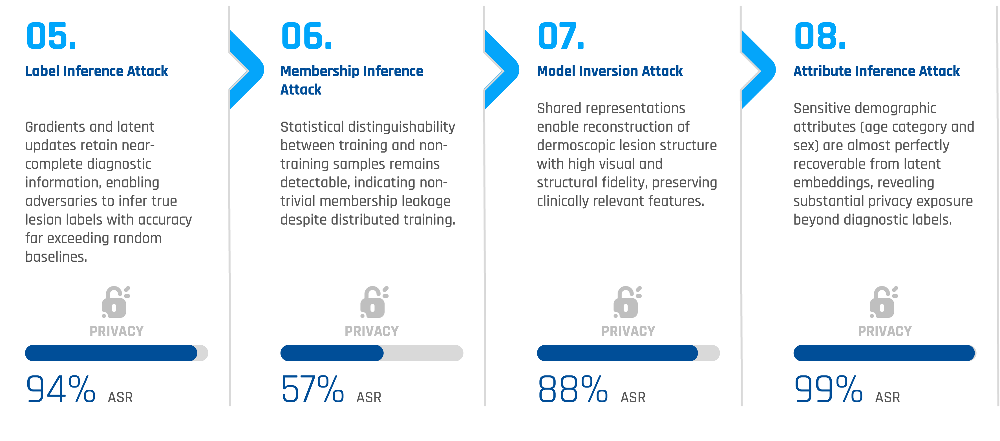

# DHARMA: Distributed Hybrid Architecture for Responsible Model Alignment and Assured Privacy

A comprehensive security audit framework for Hybrid Vertical Federated Learning (VFL) systems in medical imaging, evaluating both integrity and privacy vulnerabilities through adversarial attack analysis.

## Overview

DHARMA implements a **Hybrid Vertical Federated Learning** system that mirrors real-world clinical workflows for skin lesion classification. The framework consists of two privacy-preserving clients that collaborate through a central server without sharing raw patient data:

- **Image Client**: Represents edge hardware (e.g., Digital Dermatoscope) that captures dermoscopic images directly from patients
- **Tabular Client**: Represents the hospital's Electronic Health Record (EHR) system, holding secure metadata (Age, Sex, Anatomical Site)

In VFL, clients exchange feature embeddings that are mathematically rich representations containing highly condensed information, rather than raw data. The central server aggregates these embeddings using cross-modal attention mechanisms to make final predictions.

*Figure 1 illustrates the DHARMA architecture design, showing the Hybrid Vertical Federated Learning system with Image and Tabular clients collaborating through a central transformer server.*

## Dataset

The framework is evaluated on the **HAM10000** dataset, which contains dermoscopic skin lesion images with extreme class imbalance. Common conditions like Melanocytic nevi (`nv`) vastly outnumber rare but critical cases like Melanoma (`mel`), presenting a significant challenge for medical AI systems.

## Architecture

The DHARMA architecture implements **disentangled representation learning** where each client produces two types of embeddings:

- **Specific embeddings**: Capture modality-specific information (image-specific or tabular-specific features)
- **Invariant embeddings**: Capture cross-modal shared information that enables alignment between image and tabular representations

The transformer server aggregates these embeddings using multi-head attention mechanisms to enable cross-modal fusion and final classification.

## Notebooks

The project is organized into three sequential notebooks:

### 1. Foundation Notebook

Establishes the baseline Hybrid VFL model by:
- Training dual image and tabular clients with disentangled representations
- Training a transformer-based server for cross-modal aggregation
- Computing and caching embeddings for both training and test sets
- Evaluating baseline performance metrics (accuracy, balanced accuracy, F1-score, precision, recall)

**Outputs**: Pre-trained models, computed embeddings, and baseline performance metrics used by subsequent audit notebooks.

### 2. Integrity Audit Notebook

Evaluates the system's robustness against integrity attacks:

- **Untargeted Noise Attack**: Simulates sensor noise by adding Gaussian noise to image embeddings
- **Targeted Label-Flipping Attack**: Poisoning attack that flips labels from source class (Melanoma) to target class (Nevus)
- **Targeted Backdoor Attack**: Injects visual triggers into images to cause misclassification to a target class
- **WaveAttack**: Frequency-domain attack using wavelet transforms

**Metrics**: Attack success rate, accuracy degradation, per-class performance analysis.

*Figure 2 summarizes the integrity attacks and their outcomes, demonstrating the system's robustness against various adversarial perturbations.*

### 3. Privacy Audit Notebook

Analyzes privacy leakage through inference and reconstruction attacks:

- **Label Inference Attack**: Infers private labels from captured gradients during federated learning
- **Membership Inference Attack**: Determines whether a patient sample was part of the training set
- **Data Reconstruction Attack**: 
  - **Image Reconstruction**: Reconstructs images from image-specific embeddings (model inversion)
  - **Attribute Inference**: Infers demographic attributes (age, sex) from tabular embeddings

**Metrics**: Attack accuracy, AUC, TPR@low FPR, reconstruction quality (MSE, MAE, correlation).

*Figure 3 summarizes the privacy attacks and their outcomes, quantifying the privacy leakage through various inference and reconstruction attacks.*

## License

This project is provided for research and educational purposes.

